# Praktikum 6
## Daftar nilai mahasiswa

### Langkah 1
Memulai program dengan membuat variabel data_mahasiswa, sebuah list kosong yang akan digunakan untuk menyimpan data mahasiswa dalam bentuk dictionary. Setiap dictionary berisi dua elemen yaitu nama dan nilai:
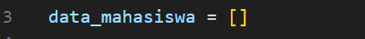

### Langkah 2
tambah(), program meminta input data mahasiswa jika pengguna memilih menu tambah(). setelah itu, data diprint ditampilkan "data telah berhasil ditambahkan" dan disimpan dalam dictiionary:
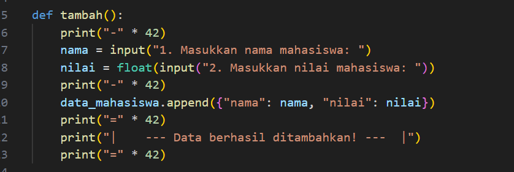

### Langkah 3
tampilkan(), program akan menampilkan data mahasiswa. jika tidak ada/else data maka akan ditampilkan "belum ada data mahasiswa". jika ada/if maka akan menampilkan no urut, nama, dan nilai. penggunaan enumerate sebagai pemberi nomor otomatis. lalu print=*34 (sebagai pembatas):
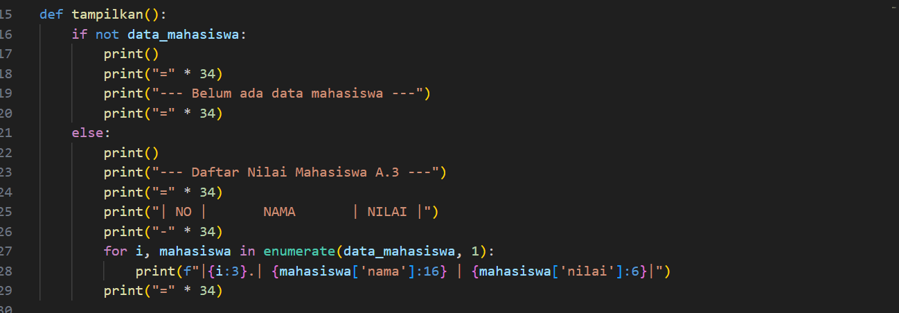

### Langkah 4
hapus(nama), pengguna meminta program untuk menghapus data mahasiswa berdasarkan nama. program meminta input data mahasiswa yang akan dihapus. elemen global (comprehension) digunakan untuk menyaring data. lalu print=*65:

### Langkah 5
ubah(nama), pemgguna meminta program untuk mengubah data yang disimpan. program meminta pengguna untuk menginput data mahasiswa yang akan diubah berdasarkan nama. float sebagai mengubah nilai lama ke nilai baru. akan ditampilkan 'data berhasil diubah". retrun print=*55 menampilkan "mahasiswa dengan nama (nama) tidak berhasi di temukan":
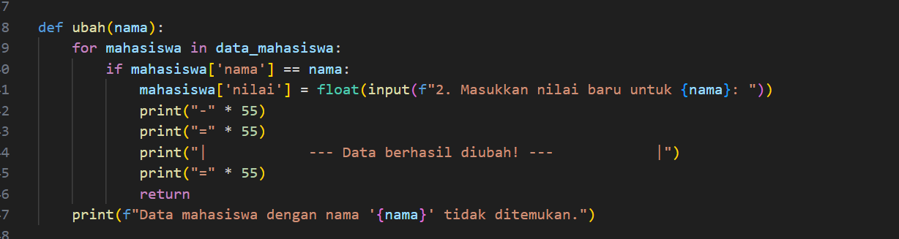

### Langkah 6
While true untuk perulangan untuk menu(Tambah Data, Tampilkan Data, Hapus Data, Ubah Data, Keluar) yang ditampilkan sampai pengguna memilih keluar. lalu print=*20, pilih menu:
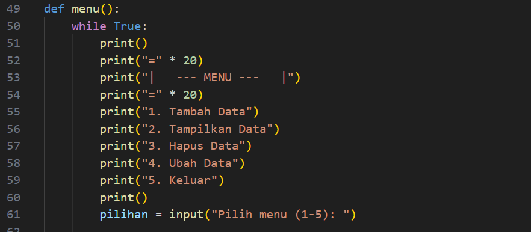

### Langkah 7
if, elif, else. kode ini untuk menangani berbagai aksi berdasarkan input pengguna (pilihan) yang diambil dari menu utama. setelah itu Input dibandingkan dengan nilai "1(tambah())", "2(tampilkan())", "3(hapus(nama))", "4(ubah(nama))", dan "5(break)". Jika tidak ada yang cocok, akan masuk ke blok else. jika pengguna memilih "5" akan ditampilkan "program selesai. terima kasih!". kemudian kembali ke menu. lalu print:
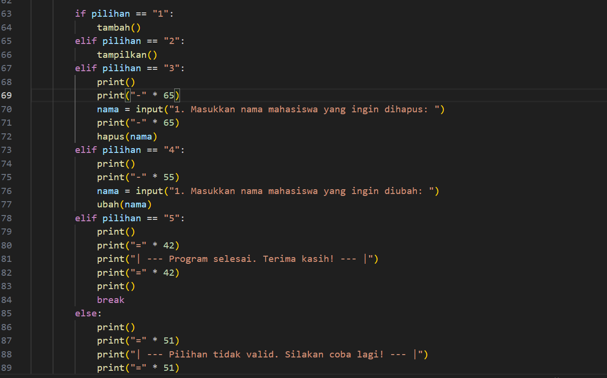

### Hasil program
menu:1
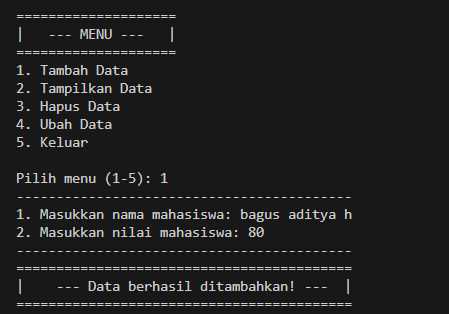

menu:2
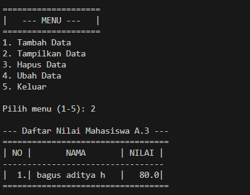
jika tidak ada data mahasiswa
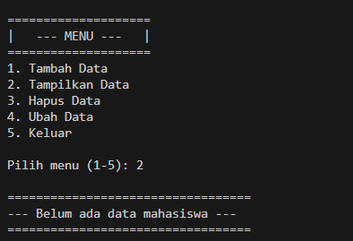

menu:3
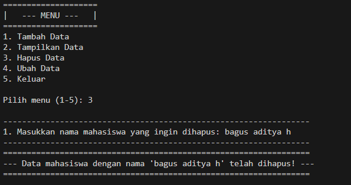

menu:4
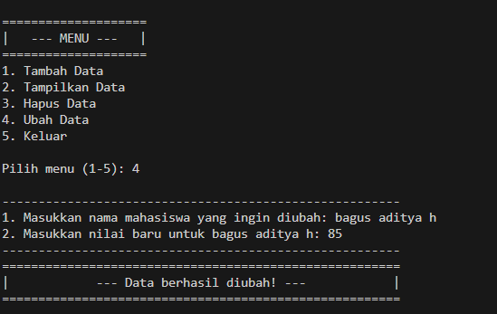

menu:5
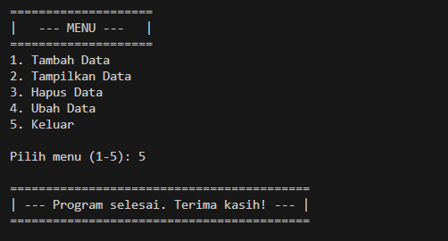

## Flowchart

### Langkah 1
Proses dimulai dengan memulai program:
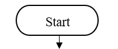

### Langkah 2
Program menampilkan menu pilihan kepada pengguna. Menu ini berisi opsi seperti: tambah data, tamppilkan data, mengubah data, menghapus data dan break:
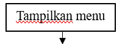

### Langkah 3
Pengguna memasukkan pilihan berdasarkan menu (1, 2, 3, 4, atau 5):
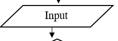

### Langkah 4
if input pengguna, sistem akan menjalankan program dengan opsi yang dipilih oleh pengguna:
[Gambar 1](screenshot/woy17.png)

### Langkah 5
Menu 1, pengguna memilih menu 1 untuk menambah data mahasiswa:
[Gambar 1](screenshot/woy18.png)

### Langkah 5
Menu 2, Program menampilkan semua data yang ada. jika tidak ada pesan "belum ada data mahasiswa":
[Gambar 1](screenshot/woy19.png)

### Langkah 6
Menu 3, Program meminta pengguna memilih data mana yang akan dihapus bedasarkan nama. Data yang dipilih dihapus dari sistem. Pesan bahwa data telah berhasil dihapus ditampilkan:
[Gambar 1](screenshot/woy20.png)

### Langkah 7
Menu 4, Program meminta pengguna memilih data yang akan diubah (nama dan nilai). Data lama diperbarui dengan nilai baru:
[Gambar 1](screenshot/woy21.png)

### Langkah 8
Menu 5, break, pesan menampilkan "program selesai,terima kasih"
[Gambar 1](screenshot/woy22.png)

### Langkah 9
Sistem untuk menyimpan perubahan atau menampilkan hasil yang telah diperbarui.
[Gambar 1](screenshot/woy23.png)

### Langkah 10
Program selesai:
[Gambar 1](screenshot/woy24.png)

[Gambar 1](screenshot/woy25.png)